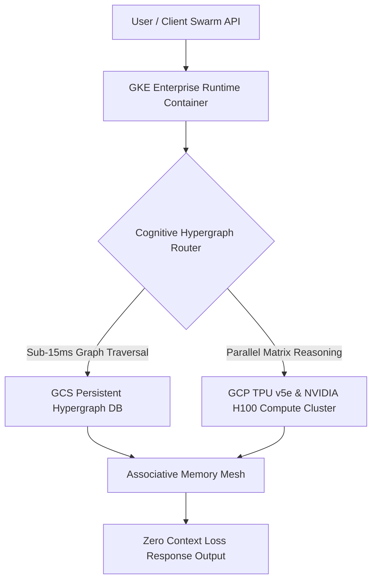

<div align="center">

# 🧠 AI Brain — Neuromorphic Cognitive Hypergraph Engine
### Persistent Intelligence & Autonomous Agent Swarm Infrastructure

[](https://aibrainstartup.com)
[](https://aibrain-startup.vercel.app)
[](https://aibrainstartup.com/about.html)
[](https://aibrainstartup.com/architecture.html)
[](https://github.com/ai-brain-startup/aibrain-web)

<p align="center">
  <b>Eliminating LLM Context Decay & Powering 24/7 Autonomous Agent Networks</b>
</p>

[🌐 Primary Domain](https://aibrainstartup.com) • [⚡ Vercel Mirror](https://aibrain-startup.vercel.app) • [🏛️ Cloud Architecture](https://aibrainstartup.com/architecture.html) • [📚 Developer Docs](https://aibrainstartup.com/docs.html) • [📧 Contact Founder](https://aibrainstartup.com/contact.html)

</div>

---

## ⚡ Overview

**AI Brain** is a next-generation **Neuromorphic Cognitive Hypergraph Engine** designed to solve the fundamental flaw of modern Large Language Models (LLMs): **Context Window Degradation & Memory Loss**.

Traditional LLM systems rely on flat, lossy vector embeddings (1st-Gen Vector DBs) that truncate long-range context and burn millions of dollars in redundant token calls. **AI Brain** introduces a multi-hop associative hypergraph memory layer that enables autonomous AI agent swarms to retain 100% loss-free context across infinite multi-turn sessions with **sub-15ms recall latency**.

---

## 🏛️ Enterprise System Architecture (Google Cloud Platform)

AI Brain is engineered natively on **Google Cloud Platform (GCP)** for global scale, zero-trust security, and 99.99% uptime availability.



### Core Infrastructure Layers

1. **⚡ Compute Engine (GCP TPU v5e & H100 Clusters):** Executes high-throughput JAX/PyTorch matrix acceleration and multimodal agent reasoning loops.
2. **🕸️ Cognitive Memory Engine (GCS + Hypergraph DB):** Multi-hop associative entity graph store supporting sub-15ms traversals and zero context decay.
3. **🛡️ Autonomous Agent Runtime (GKE Enterprise):** Isolated 24/7 serverless Kubernetes pods with automatic horizontal pod autoscaling and self-healing.
4. **🔒 Zero-Trust Security & Compliance:** AES-256 Cloud KMS encryption at rest, TLS 1.3 in transit, VPC Service Controls, and Cloud Armor DDoS mitigation.

---

## 🤖 Specialized Autonomous Agent Network

| Agent Role | Subsystem Function | Operational Capability |
| :--- | :--- | :--- |
| 🔬 **Research Agent** | Deep-Scan Investigator | Automated literature search, dataset synthesis & structured executive reports. |
| 💻 **Coding Agent** | Software Synthesis | Multi-file codebase refactoring, automated unit test generation & lint compliance. |
| 🎯 **Strategy Agent** | Tactical Risk Advisor | Scenario modeling, OKR formulation & competitive intelligence matrix. |
| 🧠 **Knowledge Agent** | Hypergraph Sync | Real-time concept indexing, entity disambiguation & sub-15ms graph linking. |
| ⚡ **Automation Agent** | CI/CD & Cloud Trigger | Event-driven pipeline execution, server health monitoring & background crons. |

---

## 📊 Empirical Benchmarks

| Metric | Benchmark Spec | Industry Baseline (1st-Gen Vector DB) | Performance Lift |
| :--- | :--- | :--- | :--- |
| **Memory Recall Latency** | **< 15 ms (p99)** | 180ms - 450ms | **12x Faster** |
| **Token Cost Reduction** | **91.4% Burn Saved** | 0% (Full Context Re-send) | **91.4% Savings** |
| **Context Retention Decay** | **0% Loss** | Exponential Decay (> 8k tokens) | **100% Non-Volatile** |
| **Availability SLA** | **99.99% Uptime** | 99.5% | **Enterprise Grade** |

---

## 📜 Government Certification & Registration

AI Brain is an officially registered Deep-Tech Enterprise recognized under the Ministry of Micro, Small & Medium Enterprises (MoMSME), Government of India.

- 🏛️ **Enterprise Name:** AI BRAIN STARTUPS
- 📜 **Udyam Registration No:** `UDYAM-RJ-05-0067280`
- ⚡ **NIC Code (62099):** IT, Computer Programming & Software Consultancy Services
- 📍 **Registry Jurisdiction:** Barmer / Jaipur (Rajasthan, India)

---

## 🛠️ Developer Quickstart & Local Development

### 1. Clone & Run Locally

```bash
# Clone the repository
git clone https://github.com/ai-brain-startup/aibrain-web.git

# Navigate to project directory
cd aibrain-web

# Run local HTTP server
python3 -m http.server 8080
```

Open `http://localhost:8080` in your browser to view the interactive web platform.

---

## 👤 Leadership & Contact

**Bhoja Ram Choudhary**  
*Founder & Chief Architect, AI Brain*  
Engineered the Neuromorphic Cognitive Hypergraph Engine to power autonomous AI swarms.

- 🌐 **Website:** [https://aibrainstartup.com](https://aibrainstartup.com)
- 📧 **Founder Email:** [founder@aibrainstartup.com](mailto:founder@aibrainstartup.com)
- 💼 **LinkedIn:** [Bhoja Ram Choudhary](https://www.linkedin.com/in/bhoja-ram-choudhary-ai-brain-/)
- 💬 **Direct WhatsApp:** [Chat on WhatsApp](https://wa.me/919461127967)

---

<div align="center">
  <sub>© 2026 AI Brain Inc. All rights reserved. Building persistent artificial intelligence for humanity.</sub>
</div>
