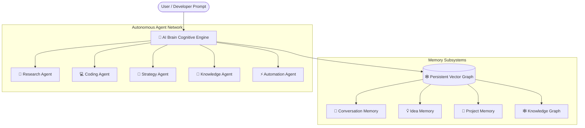

<div align="center">

# 🧠 AI Brain

### *Persistent Artificial Intelligence & Autonomous Agent Infrastructure*

[](https://aibrainstartup.com/)
[](https://www.linkedin.com/in/bhoja-ram-choudhary-ai-brain-/)
[](mailto:team@aibrainstartup.com)
[](https://aibrainstartup.com/)
[](LICENSE)

<br/>

```
    ___    ____   ____             _       
   /   |  /  _/  / __ ) _____ ____(_)___   
  / /| |  / /   / __  |/ ___/ __  / / __ \ 
 / ___ |_/ /   / /_/ / /  / /_/ / / / / / 
/_/  |_/___/  /_____/_/   \__,_/_/_/ /_/  
                                           
```

*Building persistent memory systems, autonomous agent networks, and long-term intelligence architectures for enterprises and researchers worldwide.*

---

</div>

## 🌌 Executive Overview

**AI Brain** is a next-generation cognitive artificial intelligence architecture engineered to overcome the stateless limitations of traditional prompt-response LLM models. 

While standard language models suffer from immediate context decay across sessions, **AI Brain** introduces a dual-layer cognitive engine combining **continuous vector embeddings** with a **Graph Neural Network (GNN)** to store, index, correlate, and retrieve long-term conversation, codebase, and research states.

---

## 🏛️ Core Cognitive Architecture



### 1. 💬 Conversation Memory
Retains complete semantic context from every interaction, building seamless cognitive continuity across weeks and months.

### 2. 💡 Idea Memory
Stores, indexes, and correlates creative ideas, automatically synthesizing raw thoughts into structured, actionable hypotheses.

### 3. 📁 Project Memory
Tracks real-time project states, codebase histories, milestones, and architectural decisions without context degradation.

### 4. 🕸️ Self-Evolving Knowledge Graph
Maps multi-dimensional entity relationships, forming a dynamic web of interconnected intelligence.

---

## 🤖 Specialized Autonomous Agent Network

| Agent Role | Primary Functionality | Operational Mode |
| :--- | :--- | :--- |
| 🔬 **Research Agent** | Literature discovery, citation extraction & multi-document synthesis | Autonomous Scan |
| 💻 **Coding Agent** | Multi-file codebase refactoring, unit test generation & static analysis | Synchronous / Async |
| 🎯 **Strategy Agent** | Scenario modeling, OKR formulation & execution risk assessment | Tactical Planning |
| 🧠 **Knowledge Agent** | Real-time vector indexing, schema alignment & sub-ms graph lookup | Background Service |
| ⚡ **Automation Agent** | CI/CD pipeline triggers, webhook orchestration & self-healing uptime | Event-Driven |

---

## 💻 Developer API Specification & Early Access Preview

> *Note: SDK packages (`aibrain-sdk`) are distributed via private PyPI/npm registries to waitlist members upon Early Access key issuance.*

### Installation & API Interface Preview
```bash
# Python SDK (Early Access)
pip install aibrain-sdk

# Node.js / TypeScript SDK (Early Access)
npm install @aibrain/sdk
```

### Python Example
```python
import aibrain

# Initialize client with your API key
client = aibrain.Client(api_key="sk_live_aibrain_94611")

# Query persistent memory graph across past interactions
context = client.memory.get_context(user_id="usr_architect")

# Execute autonomous agent with long-term context
response = client.agents.run(
    agent_type="research", 
    prompt="Synthesize codebase architecture changes", 
    context=context
)

print(response.output)
```

---

## ☁️ Distributed Cloud Infrastructure

AI Brain is engineered for high-throughput containerized deployments on **Google Cloud Platform (GCP)**:

- **Google Cloud Compute Engine (GPU / TPU v5e)**: Multimodal reasoning and model inference pipelines.
- **Google Cloud Storage (GCS)**: High-dimensional vector embedding storage & graph snapshots.
- **Google Cloud BigQuery & Dataform**: Real-time agent telemetry and workload analytics.
- **Google Kubernetes Engine (GKE)**: Isolated 24/7 serverless agent container clusters.

---

## 👤 Foundation & Leadership

<div align="center">

| Founder & Chief Architect | Contact & Verified Links |
| :--- | :--- |
| **Bhoja Ram Choudhary**<br/>*AI Engineer & Technology Entrepreneur* | 🏢 **Domain**: [aibrainstartup.com](https://aibrainstartup.com/)<br/>📧 **Founder Email**: [founder@aibrainstartup.com](mailto:founder@aibrainstartup.com)<br/>📫 **Team Email**: [team@aibrainstartup.com](mailto:team@aibrainstartup.com)<br/>📞 **Direct Phone**: +91 94611 27967<br/>💼 **LinkedIn**: [bhoja-ram-choudhary](https://www.linkedin.com/in/bhoja-ram-choudhary-ai-brain-/) |

</div>

---

## 📄 License & Standards

This repository contains the official web platform and architecture specifications for **AI Brain Startup**. 

- **License**: Distributed under the [MIT License](LICENSE).
- **Standards**: W3C HTML5 Semantic Compliance, Schema.org Microdata, LLM Crawler `llms.txt` 2026 Specification.

<div align="center">
  <sub>© 2026 AI Brain Startup. All rights reserved.</sub>
</div>
